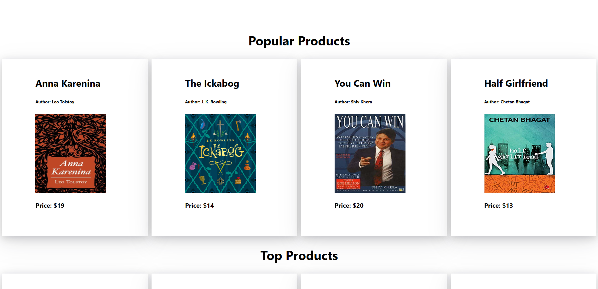

# BOOKER 


### Built with 

<p align="center">
    
</p>

- Frontend:  [React](https://react.dev/), [Styled-Components](https://styled-components.com/), [Axios](https://axios-http.com/docs/intro) & [React-Icons](https://react-icons.github.io/react-icons/)
- Backend: [Node](https://nodejs.org/en), [Express](https://expressjs.com/), [Mongoose](https://mongoosejs.com/), [JWT](https://jwt.io/) & [CryptoJs](https://www.npmjs.com/package/crypto-js)

## Demo
<p align="center"> 
  <b> <a href="https://booker-cyan.vercel.app/"> Live_Link </a>&nbsp; &nbsp; &nbsp;| &nbsp; &nbsp; &nbsp;<a href="https://github.com/Mohammad-Ashikul-Islam/Booker-Back-End-"> Backend_Code </a> </b>
</p>

<p align="center">
    <br>
    
    <br>
    
    <br>
</p>


## Features

- Create account or Login as a User
- Watch products & products details and add to cart permanently as a user
- Place order, watch live order status pending, approved, cancel or rejected as a user
- Cancel order or remove product from permanent cart as user
- Login as an admin, watch all pending orders
- As an admin, Approve or Rejeact user orders or promote a user to admin role 
- Add new product to the site as an admin
- Auto logout from current session after three hours of login

## Build Setup

**Frontend Server**

``` bash
# install dependencies
npm install 

# start server
npm start

# build for production 
npm run build

# serve in production mode 
npm run preview

```

**Backend Server**

``` bash
# install dependencies
npm install 

# start server
npm start

# start in development mode
npm run dev

```

## Deployment
- Frontend: [Vercel](https://vercel.com/)
- Backend: [Cyclic](https://www.cyclic.sh/)

> Due to [Vercel](https://render.com) and [Cyclic's](https://www.cyclic.sh/) internal system of free tier, first request on app or backend API may take longer time than the usual, even upto a minute. So, please consider the issue and wait till the Cyclic/Vercel server wakes up or reload in case of the first front-end connection freezing/backend connection freezing happens. Thank you
